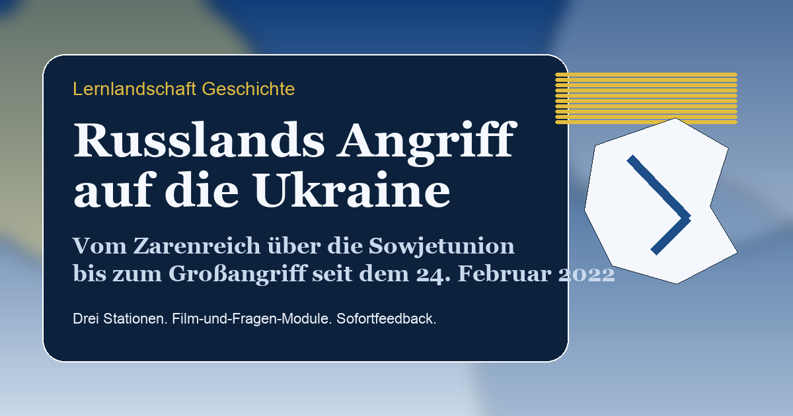

# Russlands Angriff auf die Ukraine

Statische Lernlandschaft im gleichen Aufbau wie `lernlandschaft_911_afghanistan_irak`, aber mit neuem Inhaltskorpus zu Russlands Angriff auf die Ukraine.

[Zur Live-Seite](https://patrickfischerksa.github.io/lernlandschaft_angriff_ukraine/)

## Struktur

- Drei Stationen:
  - Zarenreich
  - Sowjetunion
  - Russische Föderation und Großangriff
- Sofortkorrektur für Kurzantworten und Chronologien
- Film-und-Fragen-Modul pro Station
- Zusatzchecks im Popup
- Lehrpersonenmodus mit Diagnosehinweisen

## Dateien

- `index.html`: Rahmen, Hero und Seitenstruktur
- `styles.css`: identisches Layout mit angepasster Farbwelt
- `app.js`: bestehende Interaktionslogik, nur mit neuer Speicherkennung
- `data.js`: komplette Ukraine-Inhaltsstruktur mit Quellen und Fragen

## Lehrpersonenmodus

- Passwort: `ukraine`

## Quellenbasis

- Die drei verlinkten Dropbox-Folgen `Russlands Kriege`
- Verlinkte YouTube-Dokumentationen und Reportagen
- Ergänzende Kontextquellen von Britannica, bpb und den Vereinten Nationen
